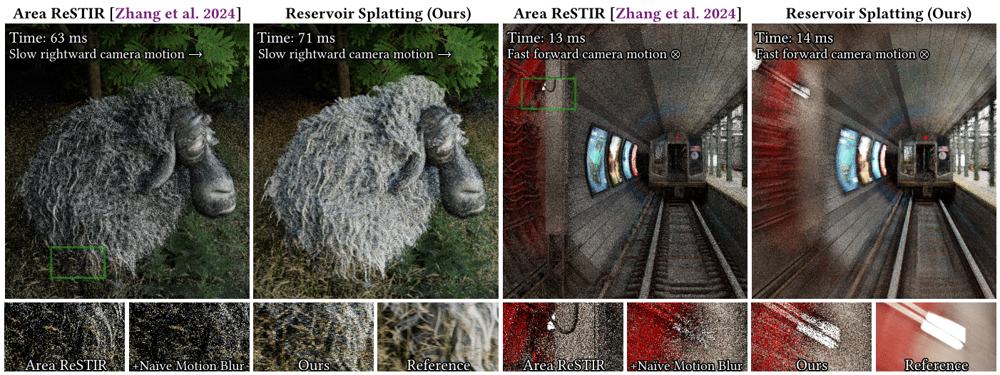

# Reservoir Splatting



## Overview

This repository contains the code for the SIGGRAPH 2025 paper:

> **Reservoir Splatting for Temporal Path Resampling and Motion Blur**<br>
> Jeffrey Liu (University of Illinois Urbana-Champaign), Daqi Lin (NVIDIA), Markus Kettunen (NVIDIA), Chris Wyman (NVIDIA), Ravi Ramamoorthi (NVIDIA and University of California San Diego)

The code is implemented as a standalone ReSTIR path tracer on top of the Falcor 8.0 framework [[Kallweit et al. 2022]](https://github.com/NVIDIAGameWorks/Falcor). Reservoir splatting is an extension of GRIS [[Lin et al. 2022]](https://research.nvidia.com/publication/2022-07_generalized-resampled-importance-sampling-foundations-restir) and Area ReSTIR [[Zhang et al. 2024]](https://graphics.cs.utah.edu/research/projects/area-restir/), which forward-reprojects primary hits from the prior frame to the current frame. This preserves *exact* primary hits across frames, which generally improves the robustness of temporal resampling.

- All relevant code can be found in the ``Source/RenderPasses/ReservoirSplatting`` render pass.
- The script ``scripts/ReservoirSplatting.py`` can be used to set up the render graph.
- Falcor loads the ``pyscene`` format, which can import different scene formats.
  - Check out ``media/test_scenes/cornell_box.pyscene`` for a simple scene, but fancier scenes can be imported through [Benedikt's rendering resources](https://benedikt-bitterli.me/resources/) or [pbrt-v4's scenes](https://github.com/mmp/pbrt-v4-scenes)!
  - This implementation uses the reconnection shift after the primary hit, so delta materials are not supported. Refer to the GRIS paper [[Lin et al. 2022]](https://research.nvidia.com/publication/2022-07_generalized-resampled-importance-sampling-foundations-restir) or the ReSTIR Course Notes [[Wyman et al. 2023]](https://intro-to-restir.cwyman.org/) for more details on different ReSTIR shift mappings.

Note that most of the reservoir splatting code has not been thoroughly optimized. Contributions are welcome!

## Cloning and Building

Make sure to clone the repository with its required submodules:

```
git clone --recursive https://github.com/Jebbly/Reservoir-Splatting.git
```

For hardware / software prerequisites and instructions on how to build Falcor, check out [Falcor's documentation](https://github.com/NVIDIAGameWorks/Falcor/blob/master/README.md). 

## Running

After building and running Mogwai, run the script in ``scripts/ReservoirSplatting.py`` to set up the reservoir splatting render graph.

### Camera Options

Depth of field and motion blur depend on the camera settings. When a scene is loaded, these can be enabled through ``Scene Settings -> Camera``:
- A non-zero aperture radius will enable depth of field.
- A non-zero shutter speed will enable motion blur.
  - Since actual frame rate is variable, we use an artificial time between frames to compute motion blur. For example, if the shutter speed is set to 1/24 s and the artificial frame time is 1/48 s, motion blur is computed across half the frame time (even if the actual frame took less time to render).
  - You can change the simulated time between frames (defaults to 60 FPS) under ``ReservoirSplatting -> Rendering Options -> Simulated Frame Time``. 

### Temporal Resampling Options

The script defaults to splat-only temporal resampling, but different options can be enabled through the UI or by modifying the script. In the UI, under ``ReservoirSplatting -> ReSTIR Options -> Temporal Resampling``, the following temporal resampling options are supported:

- ``GatherOnly`` is our (un-optimized) reimplementation of Area ReSTIR [[Zhang et al. 2024]](https://graphics.cs.utah.edu/research/projects/area-restir/). 
  - ``Fast`` and ``Robust`` are the two options presented in Area ReSTIR, while ``Clamped`` uses integer motion vectors.
  - The robust reuse optimization is enabled by default, when the ``Robust`` option is selected.
  - If the camera has a non-zero aperture radius, both the lens vertex copy and the primary hit reconnection are used.
- ``ScatterOnly`` is our single-splat implementation.
- ``ScatterBackup`` is our splat + backup implementation.
  - Our results use ``Clamped`` as the gather method and ``Balance`` as the MIS weighting scheme.
- ``MultiSplatting`` is our multi-splat implementation.
  - This option is only available when the camera has a non-zero shutter speed.
  - If the partition count is set too high, your GPU may run out of memory. 

### Utility Options

We provide a set of utility in the UI for debugging and/or capturing output.

- Using ``Scene Settings -> Freeze``, you can pause at your current frame and preserve the temporal history from the previous frame.
  - This is helpful for debugging / capturing under motion. 
  - A reference image under motion can be captured by disabling all ReSTIR options and enabling the ``AccumulationPass``. This is used for motion blurred reference images.
- Using ``Scene Settings -> User Interaction``:
  - You can record the camera motion to a text file, and then replay the same motion from the output text file.
  - By default with ``Freeze Frame ID`` set to -1, the recorded motion will loop. 
  - Setting ``Freeze Frame ID`` to a value greater than -1 will freeze the frame at the specified frame ID.
    - Unfreeze to continue playing the motion!
    - If ``Replay for Accumulation`` is enabled, the frame will no longer freeze but will instead contribute to the ``AccumulationPass``. Enable ``View Accumulated Image`` and ``AccumulatePass -> Enabled`` to view the accumulation under motion, at the specified frame ID. This is useful for verifying unbiasedness under motion, but note that this is a *very slow* process since it effectively replays the entire motion sequence for one accumulated sample. 
- Use the ``FrameDumper`` pass at the end to output every frame, which can be used to generate a video.
  - Warning: disable ``Save PNG Files`` for better performance, and use FFMPEG to composite the output pixel maps.
